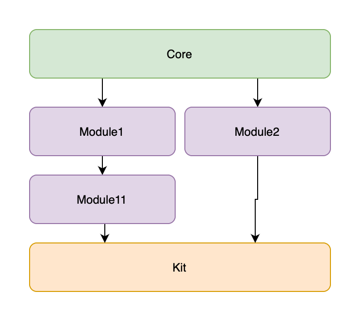

# Нипанимаю SPM

Есть библиотека. Для примера назовем ее `SPMImport`.
Там есть общая Core часть.
От этой Core части зависят два других модуля.
В итоге это все собирается в одном модуле Kit и все зависимости экспортятся, чтобы было удобно.

Вопрос: почему если модули `Module1`/`Module2` не зявисят явно друг от друга, я все равно могу прописать `import Module1` в реализации `Module2` и наоборот.
